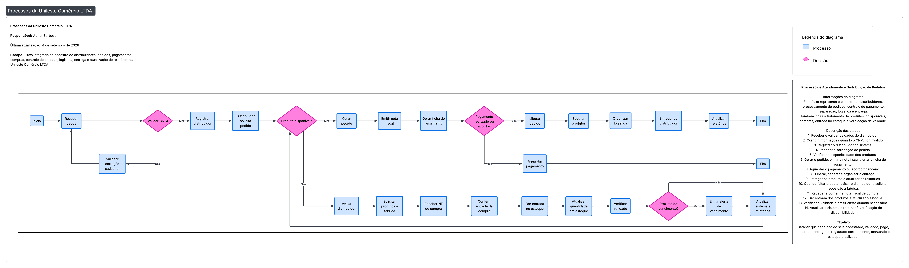

# 1. Caracterização da Organização 

- **Nome e natureza da organização:**
A organização escolhida é a Unileste Comércio LTDA., empresa de pequeno porte do setor de cosméticos e produtos capilares. A empresa atua com duas marcas comerciais — Tutti Capelli e Outlet Hair — que representam linhas distintas de produtos e pontos de venda, mas estão sob a mesma gestão administrativa e jurídica.

- **Contexto e porte:** 
A empresa possui fins lucrativos e conta atualmente com 9 funcionários diretos e cerca de 90 distribuidores que revendem seus produtos para salões de cabeleireiro. Os produtos são terceirizados — produzidos por fábricas parceiras — e comercializados exclusivamente para distribuidores, que fazem a revenda final.

- **Problemas e necessidades identificados:**
Foram identificadas dificuldades no controle das fichas de pagamento dos distribuidor, além da ausência de um sistema eficiente para monitorar o estoque, especialmente em relação à validade dos produtos e à quantidade disponível.

- **Justificativa da escolha:**
A Unileste Comércio LTDA. está consolidada há mais de 20 anos no mercado, demonstrando solidez, experiência e capacidade de adaptação às mudanças do setor. Além disso, a empresa se destaca pelo desenvolvimento de metodologias inovadoras e produtos exclusivos, o que reforça sua relevância como caso de estudo para este projeto.

- **Evidências da organização:**
O grupo possui evidências concretas de acesso à organização, incluindo endereço, contatos e registros fotográficos da visita, que comprovam a existência e a participação direta no levantamento de requisitos.

---

# 2. Processos de Negócio

## Principais processos mapeados: 

- **Cadastro de distribuidores:** registro de novos parceiros que revendem os produtos da empresa.

- **Controle de estoque:** monitoramento da quantidade de produtos disponíveis e das datas de validade.

- **Emissão de pedidos:** geração de pedidos de compra pelos distribuidores, com conferência de disponibilidade em estoque.

- **Controle de pagamentos:** acompanhamento das fichas de pagamento dos distribuidores, garantindo que os registros estejam atualizados.

- **Entregas:** organização da logística de envio dos produtos aos distribuidores.

- **Processo de compras:** aquisição de produtos junto às fábricas terceirizadas, garantindo o abastecimento contínuo do estoque.

## Fluxograma:  

O fluxograma abaixo representa os processos integrados da Unileste Comércio LTDA., incluindo cadastro de distribuidores, pedidos, pagamentos, compras, controle de estoque, logística, entrega e atualização de relatórios.

**Legenda:**
- 🔵 Azul = Processo
- 🔷 Rosa = Decisão
- ➡️ Setas = Fluxo de execução

---

# 3. Requisitos do Sistema

## 3.1 Requisitos Funcionais

- O sistema deve permitir realizar novos cadastros de distribuidores.

- O sistema deve possibilitar o controle de estoque, incluindo quantidade e validade dos produtos.

- O sistema deve emitir relatórios de validade dos produtos em estoque.

- O sistema deve permitir o controle de pagamentos dos distribuidores/clientes.

- O sistema deve possibilitar a geração de pedidos de compra.

- O sistema deve registrar as notas fiscais relacionadas aos pedidos.

## 3.2 Requisitos Não Funcionais

- **Segurança:** garantir a proteção dos dados dos distribuidores e das transações financeiras.

- **Usabilidade:** interface simples e intuitiva para facilitar o uso por funcionários e administradores.

- **Desempenho:** respostas rápidas às consultas de estoque e relatórios.

- **Disponibilidade:** sistema acessível em tempo integral, evitando interrupções nas operações.

- **Escalabilidade:** capacidade de expansão para suportar aumento no número de distribuidores e produtos.

---

# 4. Regras de Negócio

- **Regras operacionais:**

O sistema deve emitir aviso quando o estoque de um produto estiver esgotado ou prestes a se esgotar.

Para que uma nota fiscal seja gerada, é obrigatório que todos os dados estejam preenchidos e que o produto esteja disponível em estoque.

Um pedido só pode ser liberado mediante pagamento ou mediante acordo formal com o gerente financeiro para pagamento futuro.

- **Restrições organizacionais:**

A liberação de pedidos está condicionada às políticas internas de pagamento, que exigem quitação imediata ou autorização do gerente financeiro.

O controle de estoque deve atender às exigências legais de validade dos produtos, garantindo que nenhum item vencido seja comercializado.

A emissão de notas fiscais deve seguir as normas fiscais e tributárias vigentes, assegurando conformidade com a legislação.

---

# 5. Dicionário de Dados Conceitual (Preliminar)

## Entidade: Distribuidor

| Atributo | Descrição | Regra de negócio associada |
| --- | --- | --- |
| id_distribuidor | Identificador único do distribuidor | Obrigatório, valor único |
| Nome | Nome do distribuidor | Obrigatório |
| CNPJ | Cadastro Nacional da Pessoa Jurídica | Deve ser válido e único |
| Endereço | Localização do distribuidor | Obrigatório |
| Telefone | Contato principal | Opcional |

## Entidade: Produto

| Atributo | Descrição | Regra de negócio associada |
| --- | --- | --- |
| id_produto | Identificador único do produto | Obrigatório, valor único |
| Nome | Nome comercial do produto | Obrigatório |
| Categoria | Categoria/Linha do produto (ex: Tutti Capelli) | Obrigatório |
| Preço | Valor de venda do produto | Deve ser positivo |

## Entidade: Pedido

| Atributo | Descrição | Regra de negócio associada |
| --- | --- | --- |
| id_pedido | Identificador único do pedido | Obrigatório |
| Data | Data de emissão do pedido | Obrigatório |
| Status | Situação do pedido (pendente, pago, entregue) | Deve seguir valores pré-definidos |
| id_distribuidor | Distribuidor que realizou o pedido | Obrigatório, chave estrangeira |

## Entidade: Nota Fiscal

| Atributo | Descrição | Regra de negócio associada |
| --- | --- | --- |
| id_nf | Identificador único da nota | Obrigatório |
| Número | Número oficial da nota | Obrigatório, único |
| Data | Data de emissão | Obrigatório |
| Valor | Valor total da nota | Deve ser positivo |
| id_pedido | Pedido associado | Obrigatório, chave estrangeira |

## Entidade: Pagamento

| Atributo | Descrição | Regra de negócio associada |
| --- | --- | --- |
| id_pagamento | Identificador único do pagamento | Obrigatório |
| Data | Data do pagamento | Obrigatório |
| Valor | Valor pago | Deve ser positivo |
| Forma | Forma de pagamento (boleto, transferência, etc.) | Obrigatório |
| id_pedido | Pedido associado | Obrigatório, chave estrangeira |

## Entidade: Estoque

| Atributo | Descrição | Regra de negócio associada |
| --- | --- | --- |
| id_estoque | Identificador único do estoque | Obrigatório |
| id_produto | Produto armazenado | Obrigatório, chave estrangeira |
| Quantidade | Quantidade disponível | Não pode ser negativa |
| Validade | Data de validade do produto | Permite controlar produtos próximos do vencimento |
| id_compra | Compra que originou este lote | Obrigatório, chave estrangeira |

## Entidade: Compra

| Atributo | Descrição | Regra de negócio associada |
| --- | --- | --- |
| id_compra | Identificador único da compra | Obrigatório |
| Data | Data da compra | Obrigatório |
| Fornecedor | Fábrica terceirizada | Obrigatório |
| Valor | Valor da compra | Deve ser positivo |

--- 

# 6. Modelagem Conceitual (Entidades, Atributos, Relacionamentos)

## Entidades reconhecidas

Entidade        | Justificativa
----------------|------------------------------------------------------------
Distribuidor    | Representa os parceiros que revendem os produtos da empresa
Produto         | Representa os itens comercializados pelas marcas Tutti Capelli e Outlet Hair
Pedido          | Formaliza a solicitação de compra feita pelos distribuidores
Nota Fiscal     | Documento fiscal obrigatório que valida cada transação
Pagamento       | Registra a quitação financeira dos pedidos
Estoque         | Controla a quantidade e validade dos produtos disponíveis
Compra          | Representa a aquisição de produtos junto às fábricas terceirizadas

<!-- Nota: nesta primeira etapa, a entidade Nota Fiscal representa apenas a nota fiscal de venda (vinculada ao Pedido). A nota fiscal de compra, emitida pela fábrica fornecedora e recebida no processo de entrada em estoque (ver Fluxograma), será incorporada ao modelo em uma etapa futura, junto com o refinamento do relacionamento Compra–Estoque. -->

## Atributos e classificações

Os atributos e suas respectivas classificações estão detalhados no Dicionário de Dados Conceitual (Seção 5), que apresenta os atributos de cada entidade, suas descrições e as regras de negócio associadas.

## Relacionamentos pertinentes

Relacionamento                  | Descrição
--------------------------------|------------------------------------------------------------
Distribuidor -> Pedido          | Um distribuidor pode realizar vários pedidos
Pedido -> Nota Fiscal           | Cada pedido gera uma nota fiscal correspondente
Pedido -> Pagamento             | Um pedido pode ter um ou mais pagamentos associados
Pedido -> Produto               | Um pedido é composto por um ou mais produtos, e um produto pode constar em diversos pedidos.
Compra -> Estoque               | Uma compra pode gerar vários registros de estoque, correspondentes aos lotes recebidos.
Produto -> Estoque              | Um produto pode possuir vários lotes armazenados no estoque, e cada registro de estoque pertence a um único produto.

## Restrições e políticas organizacionais aplicadas ao modelo

Restrição/Política               | Impacto no modelo
---------------------------------|------------------------------------------------------------
Pedido liberado após pagamento ou acordo | Liberação condicionada ao pagamento ou acordo
Nota Fiscal só pode ser emitida com produto em estoque | Emissão condicionada à disponibilidade do Estoque
Produtos não podem ser vendidos após a validade | Atributo Validade do Produto deve ser controlado
Estoque não pode ter quantidade negativa | Atributo Quantidade deve ter restrição >= 0

---

# 7. Diagrama Entidade-Relacionamento (DER)

## Entidades e Relacionamentos

<!--Nota: O arquivo de imagem do DER está anexado separadamente na pasta raiz deste repositório. -->

Entidade        | Relacionamento                          | Cardinalidade
----------------|-----------------------------------------|--------------------------------------------
Distribuidor    | Realiza Pedido                          | 1 Distribuidor pode realizar N Pedidos
Pedido          | Gera Nota Fiscal                        | 1 Pedido gera 1 Nota Fiscal
Pedido          | Possui Pagamento                        | 1 Pedido pode ter N Pagamentos
Produto         | Possui Lotes em Estoque                 | 1 Produto pode ter N registros de Estoque
Compra          | Abastece Estoque                        | 1 Compra pode abastecer N registros de Estoque 
Nota Fiscal     | Vinculada a Pedido                      | 1 Nota Fiscal corresponde a 1 Pedido

## Cardinalidades principais

Distribuidor – Pedido: 1:N (um distribuidor pode ter vários pedidos).

Pedido – Nota Fiscal: 1:1 (cada pedido gera uma nota fiscal única).

Pedido – Pagamento: 1:N (um pedido pode ter vários pagamentos).

Pedido – Produto: N:M (um pedido pode conter vários produtos, e um mesmo produto pode estar presente em vários pedidos diferentes).

Compra – Estoque : 1 Compra pode abastecer N registros de Estoque.

Produto – Estoque: 1:N (um produto do catálogo pode ter vários lotes registrados no estoque, enquanto cada lote/registro de estoque pertence a um único produto).

---

# 8. Justificativa Técnica

## Decisões de abstração e modelagem

Decisão                         | Justificativa
--------------------------------|------------------------------------------------------------
Escolha das entidades           | Foram selecionadas entidades que representam os principais elementos operacionais da empresa: Distribuidor, Produto, Pedido, Nota Fiscal, Pagamento, Estoque e Compra. Cada uma reflete processos reais observados.
Atributos obrigatórios          | Definidos para garantir integridade dos dados (ex.: ID único, CNPJ válido, quantidade >= 0, validade futura). Isso assegura consistência e evita erros operacionais.
Relacionamentos 1:1             | Pedido-Nota Fiscal foi definido como 1:1, pois cada pedido gera uma nota fiscal única, conforme exigência legal.
Relacionamentos 1:N             | Compra-Estoque foi modelado como 1:N, pois uma compra pode gerar vários registros de estoque, correspondentes aos lotes recebidos, enquanto cada registro de estoque possui uma única compra de origem.
Cardinalidades                  | Foram aplicadas para refletir a realidade operacional: controle de estoque, múltiplos pedidos por distribuidor, restrição de validade dos produtos e pagamento ou acordo para liberação de pedidos.
Restrições organizacionais      | Incorporadas ao modelo para atender exigências legais (nota fiscal obrigatória, validade de produtos) e políticas internas (liberação de pedidos mediante pagamento ou acordo).

## Por que não outras alternativas?

Alternativa                      | Motivo da rejeição
---------------------------------|------------------------------------------------------------
Liberar pedido sem pagamento ou acordo | Rejeitado porque não atende à política interna.
Ignorar validade dos produtos    | Rejeitado porque a validade é crítica no setor de cosméticos e impacta diretamente a conformidade legal e a qualidade.
Modelar Nota Fiscal de compra na mesma entidade | Rejeitado nesta etapa para não sobrecarregar o modelo conceitual inicial; nota fiscal de compra será tratada como extensão futura do modelo.

## Justificativa do DER

O Diagrama Entidade-Relacionamento (DER) foi elaborado para representar de forma estruturada os principais processos da Unileste Comércio LTDA. As entidades escolhidas — Distribuidor, Pedido, Produto, Pagamento, Nota Fiscal, Compra e Estoque — refletem diretamente as operações observadas na empresa.

Os relacionamentos definidos garantem integridade e consistência dos dados: distribuidores realizam pedidos, cada pedido gera nota fiscal, pagamento e entrega, enquanto as compras abastecem o estoque e os produtos são controlados por validade e quantidade.

Esse modelo evita redundâncias, facilita consultas e assegura que todas as etapas do fluxo de negócio estejam corretamente representadas, servindo como base sólida para o desenvolvimento de um sistema de informação confiável e eficiente.

## Conclusão

O modelo conceitual foi estruturado para refletir fielmente os processos da Unileste Comércio LTDA., garantindo integridade dos dados, conformidade legal e suporte às operações reais da empresa. As entidades, atributos, relacionamentos e cardinalidades escolhidos permitem escalabilidade e integração futura, atendendo tanto às necessidades atuais quanto à evolução do sistema.

---

## 9. Uso de Inteligência Artificial

Item                         | O que registrar
-----------------------------|------------------------------------------------------------
Ferramenta e etapa           | Microsoft Copilot (IA) utilizada na redação do README, organização dos requisitos, modelagem conceitual e estruturação das tabelas.
Motivação                    | O grupo recorreu à IA para agilizar a escrita, garantir clareza na documentação e padronizar o formato exigido pelo professor.
Prompt(s) utilizados         | Exemplos: "Monte a seção 1 com base nestes dados da empresa que estou te passando em anexo", "Monte a seção 6 com atributos e classificações".
Resposta recebida            | A IA forneceu textos estruturados, tabelas formatadas e explicações sobre entidades, atributos, relacionamentos e regras de negócio.
Fontes consultadas e verificadas | As informações foram validadas pelo grupo com base nos dados reais da empresa Unileste Comércio LTDA. e na visita de campo.
Trechos rejeitados ou corrigidos | Ajustes manuais foram feitos para adequar termos técnicos e simplificar descrições conforme a realidade observada.
Justificativa da escolha final | O grupo manteve as sugestões da IA porque estavam alinhadas ao modelo exigido e facilitaram a padronização do documento.
Reflexão crítica             | O uso da IA trouxe agilidade e organização, mas exigiu revisão crítica para evitar generalizações e garantir que os dados refletissem fielmente a empresa estudada.

