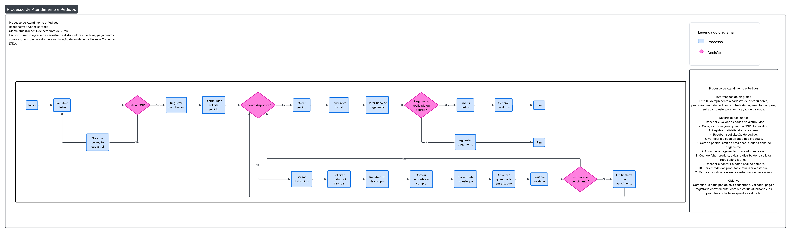

# UNILESTE COSMÉTICOS

## INTEGRANTES

| NOME | RGM |
| --- | --- |
| Abner Barbosa Machado        | 4662540-2 |
| Kauã Freitas Passos Perroni. |           |
| Luís Cauan Sena Rodrigues.   |           |

# 1. Caracterização da Organização 

- **Nome e natureza da organização:**
A organização escolhida é a Unileste Comércio LTDA., empresa de médio porte do setor de cosméticos e produtos capilares. A empresa atua com duas marcas comerciais — Tutti Capelli e Outlet Hair — que representam linhas distintas de produtos e pontos de venda, mas estão sob a mesma gestão administrativa e jurídica.

- **Contexto e porte:** 
A empresa possui fins lucrativos e conta atualmente com 9 funcionários diretos e cerca de 90 distribuidores que revendem seus produtos para salões de cabeleireiro. Os produtos são terceirizados — produzidos por fábricas parceiras — e comercializados exclusivamente para distribuidores, que fazem a revenda final.

- **Problemas e necessidades identificados:**
Foram identificadas dificuldades no controle das fichas de pagamento dos distribuidor, além da ausência de um sistema eficiente para monitorar o estoque, especialmente em relação à validade dos produtos e à quantidade disponível.

- **Justificativa da escolha:**
A Unileste Comércio LTDA. está consolidada há mais de 20 anos no mercado, demonstrando solidez, experiência e capacidade de adaptação às mudanças do setor. Além disso, a empresa se destaca pelo desenvolvimento de metodologias inovadoras e produtos exclusivos, o que reforça sua relevância como caso de estudo para este projeto.

- **Evidências da organização:**
O grupo possui evidências concretas de acesso à organização, incluindo endereço, contatos e registros fotográficos da visita, que comprovam a existência e a participação direta no levantamento de requisitos.

---

# 2. Processos de Negócio

## Principais processos mapeados: 

- **Cadastro de distribuidores:** registro de novos parceiros que revendem os produtos da empresa.

- **Controle de estoque:** monitoramento da quantidade de produtos disponíveis e das datas de validade.

- **Emissão de pedidos:** geração de pedidos de compra pelos distribuidores, com conferência de disponibilidade em estoque.

- **Controle de pagamentos:** acompanhamento das fichas de pagamento dos distribuidores, garantindo que os registros estejam atualizados.

- **Entregas:** organização da logística de envio dos produtos aos distribuidores.

- **Processo de compras:** aquisição de produtos junto às fábricas terceirizadas, garantindo o abastecimento contínuo do estoque.

## Fluxograma:  

O fluxograma abaixo representa os processos integrados da Unileste Comércio LTDA., incluindo cadastro de distribuidores, pedidos, pagamentos, compras, controle de estoque, logística, entrega e atualização de relatórios.

**Legenda:**
- 🔵 Azul = Processo
- 🔷 Rosa = Decisão
- ➡️ Setas = Fluxo de execução

---

# 3. Requisitos do Sistema

## 3.1 Requisitos Funcionais

- O sistema deve permitir realizar novos cadastros de distribuidores.

- O sistema deve possibilitar o controle de estoque, incluindo quantidade e validade dos produtos.

- O sistema deve emitir relatórios de validade dos produtos em estoque.

- O sistema deve permitir o controle de pagamentos dos distribuidores/clientes.

- O sistema deve possibilitar a geração de pedidos de compra.

- O sistema deve registrar as notas fiscais relacionadas aos pedidos.

## 3.2 Requisitos Não Funcionais

- **Segurança:** garantir a proteção dos dados dos distribuidores e das transações financeiras.

- **Usabilidade:** interface simples e intuitiva para facilitar o uso por funcionários e administradores.

- **Desempenho:** respostas rápidas às consultas de estoque e relatórios.

- **Disponibilidade:** sistema acessível em tempo integral, evitando interrupções nas operações.

- **Escalabilidade:** capacidade de expansão para suportar aumento no número de distribuidores e produtos.

---

# 4. Regras de Negócio

- **Regras operacionais:**

O sistema deve emitir aviso quando o estoque de um produto estiver esgotado ou prestes a se esgotar.

Para que uma nota fiscal seja gerada, é obrigatório que todos os dados estejam preenchidos e que o produto esteja disponível em estoque.

Um pedido só pode ser liberado mediante pagamento ou mediante acordo formal com o gerente financeiro para pagamento futuro.

- **Restrições organizacionais:**

A liberação de pedidos está condicionada às políticas internas de pagamento, que exigem quitação imediata ou autorização do gerente financeiro.

O controle de estoque deve atender às exigências legais de validade dos produtos, garantindo que nenhum item vencido seja comercializado.

A emissão de notas fiscais deve seguir as normas fiscais e tributárias vigentes, assegurando conformidade com a legislação.

---

# 5. Dicionário de Dados Conceitual (Preliminar)

## Entidade: Distribuidor

| Atributo | Descrição | Regra de negócio associada |
| --- | --- | --- |
| id_distribuidor (PK) | Identificador único do distribuidor | Obrigatório, valor único e (chave primária) |
| nome | Nome do distribuidor | Obrigatório |
| CNPJ | Cadastro Nacional da Pessoa Jurídica | Deve ser válido e único |
| endereço | Localização do distribuidor | Obrigatório |
| telefone | Contato principal do distribuidor | Opcional |

## Entidade: Produto

| Atributo | Descrição | Regra de negócio associada |
| --- | --- | --- |
| id_produto (PK) | Identificador único do produto | Obrigatório, valor único e (chave primária) |
| nome | Nome comercial do produto | Obrigatório |
| tipo | Classificação do produto (ex.: Shampoo, Condicionador, Máscara Capilar, etc.) | Obrigatório e deve pertencer aos tipos permitidos pelo sistema |
| preço | Valor de venda do produto | Deve ser positivo |

## Entidade: Pedido

| Atributo | Descrição | Regra de negócio associada |
| --- | --- | --- |
| id_pedido (PK) | Identificador único do pedido | Obrigatório, valor único e (chave primária) |
| data | Data de emissão do pedido | Obrigatório |
| status | Situação do pedido (pendente, pago, entregue) | Deve seguir valores pré-definidos |
| id_distribuidor (FK)| identificador do distribuidor que realizou o pedido | Obrigatório e (chave estrangeira) |

## Entidade: Item_Pedido

| Atributo | Descrição | Regra de negócio associada |
| --- | --- | --- |
| id_item_pedido (PK) | Identificador único do item do pedido | Obrigatório, valor único |
| id_pedido (FK) | Identificador do pedido ao qual o item pertence | Obrigatório e (chave estrangeira) |
| id_produto (FK) | Identificador do produto incluído no pedido | Obrigatório e (chave estrangeira) |
| quantidade | Quantidade solicitada do produto | Obrigatório e deve ser maior que zero |

## Entidade: Nota Fiscal

| Atributo | Descrição | Regra de negócio associada |
| --- | --- | --- |
| id_nf (PK) | Identificador único da nota | Obrigatório, valor único e (chave primária) |
| número | Número oficial da nota | Obrigatório e único |
| data | Data de emissão | Obrigatório |
| valor | Valor total da nota | Deve ser positivo |
| id_pedido (FK) | Identificador do pedido associado | Obrigatório e (chave estrangeira) |

## Entidade: Pagamento

| Atributo | Descrição | Regra de negócio associada |
| --- | --- | --- |
| id_pagamento (PK) | Identificador único do pagamento | Obrigatório e (chave primária) |
| Data | Data do pagamento | Obrigatório |
| Valor | Valor pago | Deve ser positivo |
| Forma | Forma de pagamento (boleto, transferência, etc.) | Obrigatório |
| id_pedido (FK) | Identificador do pedido associado | Obrigatório e (chave estrangeira) |

## Entidade: Fornecedor

| Atributo | Descrição | Regra de negócio associada |
| --- | --- | --- |
| id_fornecedor (PK) | Identificador único do fornecedor | Obrigatório, valor único e (chave primária) |
| id_nome | Nome do fornecedor | Obrigatório |
| CNPJ | Cadastro Nacional da Pessoa Juríica | Dever ser válido e único |
| endereço | Endereço do fornecedor | Obrigatório |
| telefone | contato do fornecedor | Obrigatório |

## Entidade: Compra

| Atributo | Descrição | Regra de negócio associada |
| --- | --- | --- |
| id_compra (PK)| Identificador único da compra | Obrigatório, valor único e (Chave primária) |
| data | Data da compra | Obrigatório |
| id_fornecedor (FK) | Identificador do fornecedor | Obrigatório e (chave estrangeira) |
| Valor | Valor da compra | Deve ser positivo |

## Entidade: Lote

| Atributo | Descrição | Regra de negócio associada |
| --- | --- | --- |
| id_lote (PK) | Identificador único do lote | Obrigatório, valor único e (chave primária) |
| id_compra (FK) | Identificador da compra que originou o lote | Obrigatório e (Chave estrangeira) |
| id_produto (FK) | Identificador do produto ao qual o lote pertence   | Obrigatório e (chave estrangeira) |
| quantidade | Quantidade de produtos existentes no lote | Obrigatório e deve ser maior que zero |  
| validade | Data e validade do lote | Obrigatório e deve ser uma data válida igual ou posterior à data da compra |

--- 

# 6. Modelagem Conceitual (Entidades, Atributos, Relacionamentos)

## Entidades reconhecidas

Entidade        | Justificativa
----------------|------------------------------------------------------------
Distribuidor    | Representa os parceiros que revendem os produtos da empresa.
Produto         | Representa os itens comercializados pela organização.
Pedido          | Formaliza a solicitação de compra feita pelos distribuidores.
Item_Pedido     | Representa cada produto incluído em um pedido, permitindo múltiplos produtos por pedido.
Nota Fiscal     | Documento fiscal obrigatório que valida cada transação.
Pagamento       | Registra a quitação financeira dos pedidos.
Fornecedor      | Representa as fábricas terceirizadas responsáveis pelo fornecimento dos produtos.
Compra          | Representa a aquisição de produtos junto aos fornecedors.
Lote            | Controla os lotes recebidos, permitindo rastrear quantidade, validade e origem da compra.

<!-- Nota: nesta primeira etapa, a entidade Nota Fiscal representa apenas a nota fiscal de venda (vinculada ao Pedido). A nota fiscal de compra, emitida pela fábrica fornecedora e recebida no processo de entrada em estoque (ver Fluxograma), será incorporada ao modelo em uma etapa futura, junto com o refinamento do relacionamento Compra–Estoque. -->

## Atributos e classificações

Os atributos de cada entidade estão descritos no Dicionário de Dados Conceitual (Seção 5), contendo sua identificação, descrição e respectivas regras de negócio.

## Classificação dos atributos

**Chaves Primárias (PK):** id_distribuidor, id_produto, id_pedido, id_item_pedido, id_nf, id_pagamento, id_fornecedor, id_compra e id_lote.

**Chaves Estrangeiras (FK):** id_distribuidor em Pedido; id_pedido e id_produto em Item_Pedido; id_pedido em Nota Fiscal; id_pedido em Pagamento; id_fornecedor em Compra; id_compra e id_produto em Lote.

**Atributos descritivos:** nome, endereço, telefone, data, status, valor, forma, tipo, número, quantidade e validade.

## Relacionamentos pertinentes

Relacionamento                  | Descrição
--------------------------------|------------------------------------------------------------
Distribuidor -> Pedido          | Um distribuidor pode realizar vários pedidos, enquanto cada pedido pertence a um único distribuidor.
Pedido -> Item_Pedido           | Um pedido pode possuir vários itens, e cada item pertence a um único pedido.
Item_Pedido -> Produto          | Cada item corresponde a um único produto, enquanto um produto pode aparecer em diversos itens de pedidos.
Pedido -> Nota Fiscal           | Um pedido pode gerar uma única nota fiscal, e cada nota fiscal pertence a um único pedido.
Pedido -> Pagamento             | Um pedido pode ter um ou mais pagamentos associados
Fornecedor -> Compra            | Um fornecedor pode realizar várias vendas para a organização, enquanto cada compra pertence a um único fornecedor.
Compra -> Lote                  | Uma compra pode gerar vários lotes, e cada lote é originado por uma única compra.
Produto -> Lote                 | Um produto pode possuir diversos lotes, enquanto cada lote pertence a um único produto.

## Restrições e políticas organizacionais aplicadas ao modelo

Restrição/Política               | Impacto no modelo
---------------------------------|------------------------------------------------------------
Um pedido deve estar vinculado a um distribuidor cadastrado. | Garante a integridade dos pedidos.
Cada item do pedido deve referenciar um produto existente. | Impede a inclusão de produtos inexistentes.
A quantidade do item do pedido deve ser maior que zero. | Evita registros inválidos.
A nota fiscal deve estar vinculada a um único pedido. | Mantém a conformidade fiscal.
Um lote deve pertencer simultaneamente a uma única compra e a um único produto. | Garante a rastreabilidade do estoque.
Produtos não podem ser comercializados após o vencimento. | O atributo validade do lote deve ser controlado.
Valores monetários de compras, pagamentos e notas fiscais devem ser positivos. | Evita inconsistências financeiras.

---

# 7. Diagrama Entidade-Relacionamento (DER)

## Entidades e Relacionamentos

<!--Nota: O arquivo de imagem do DER está anexado separadamente na pasta raiz deste repositório. -->

Entidade        | Relacionamento                          | Cardinalidade
----------------|-----------------------------------------|--------------------------------------------
Distribuidor    | Realiza Pedido                          | 1 Distribuidor pode realizar N Pedidos
Pedido          | Possui Item_Pedido                      | 1 Pedido pode possuir N Itens de Pedido
Item_Pedido     | Refere_se a Produto                     | 1 Produto pode estar em N Itens de Pedido
Pedido          | Gera Nota Fiscal                        | 1 Pedido gera 1 Nota Fiscal
Nota Fiscal     | Vinculada a Pedido                      | 1 Nota Fiscal corresponde a 1 Pedido
Pedido          | Possui Pagamento                        | 1 Pedido pode ter N Pagamentos
Fornecedor      | Fornece Compra                          | 1 Fornecedor pode fornecer N Compras
Compra          | Abastece Lote                           | 1 Compra pode gerar N Lotes 
Produto         | Pertence a Lote                         | 1 Produto pode possuir N Lotes

## Cardinalidades principais

**Distribuidor – Pedido:** 1:N (um distribuidor pode realizar vários pedidos).

**Pedido – Item_Pedido:** 1:N (um pedido pode possuir vários itens).

**Item_Pedido – Produto:** N:1 (cada item refere-se a um único produto, enquanto um produto pode aparecer em diversos itens).

**Pedido – Nota Fiscal:** 0:1 (um pedido pode ainda não possuir nota fiscal; quando emitida, pertence a um único pedido).

**Pedido – Pagamento:** 1:N (um pedido pode possuir um ou mais pagamentos).

**Fornecedor – Compra:** 1:N (um fornecedor pode estar associado a várias compras).

**Compra – Lote:** 1:N (uma compra pode gerar vários lotes).

**Produto – Lote:** 1:N (um produto pode possuir diversos lotes).

# 8. Justificativa Técnica

## Decisões de abstração e modelagem

Decisão                         | Justificativa
--------------------------------|------------------------------------------------------------
Escolha das entidades           | Foram selecionadas entidades que representam os principais processos operacionais da Unileste Comércio LTDA.: Distribuidor, Pedido, Item_Pedido, Produto, Nota Fiscal, Pagamento, Fornecedor, Compra e Lote. Cada uma corresponde a uma etapa real observada na empresa.
Atributos obrigatórios          | Foram definidos atributos essenciais para garantir integridade dos dados, como identificadores únicos, CNPJ válido, quantidade maior que zero e valores monetários positivos.
Relacionamentos 0:1             | Foi modelado como 0:1, pois um pedido pode ainda não ter nota fiscal emitida; quando emitida, ela pertence exclusivamente a um único pedido.
Relacionamentos 1:N             | Ambos foram definidos como 1:N para representar que uma compra pode gerar vários lotes e que um produto pode existir em diversos lotes, mantendo a rastreabilidade do estoque.
Cardinalidades                  | Foram definidas para representar fielmente o funcionamento da empresa, evitando redundâncias e garantindo consistência entre pedidos, produtos, compras e lotes.
Restrições organizacionais      | Incorporadas ao modelo para atender exigências legais (nota fiscal obrigatória, validade de produtos) e políticas internas (liberação de pedidos mediante pagamento ou acordo).

## Por que não outras alternativas?

Alternativa                      | Motivo da rejeição
---------------------------------|------------------------------------------------------------
Liberar pedido sem pagamento ou acordo | Rejeitado porque não atende à política interna.
Ignorar validade dos produtos    | Rejeitado porque a validade é crítica no setor de cosméticos e impacta diretamente a conformidade legal e a qualidade.
Modelar Nota Fiscal de compra na mesma entidade | Rejeitado nesta etapa para não sobrecarregar o modelo conceitual inicial; nota fiscal de compra será tratada como extensão futura do modelo.
Permitir um lote vinculado a várias compras | Rejeitada porque cada lote deve possuir uma única compra de origem, garantindo rastreabilidade.

## Justificativa do DER

O Diagrama Entidade-Relacionamento (DER) foi elaborado para representar de forma estruturada os principais processos da Unileste Comércio LTDA.   O modelo contempla as operações de distribuição, vendas, pagamentos, compras e controle de estoque por lotes, permitindo representar o fluxo completo desde a aquisição dos produtos junto aos fornecedores até sua comercialização aos distribuidores.

Os relacionamentos definidos garantem integridade e consistência dos dados: distribuidores realizam pedidos, cada pedido gera nota fiscal, pagamento e entrega, enquanto as compras abastecem o estoque e os produtos são controlados por validade e quantidade.

Esse modelo evita redundâncias, facilita consultas e assegura que todas as etapas do fluxo de negócio estejam corretamente representadas, servindo como base sólida para o desenvolvimento de um sistema de informação confiável e eficiente.

## Conclusão

O modelo conceitual foi estruturado para refletir fielmente os processos da Unileste Comércio LTDA., garantindo integridade dos dados, conformidade legal e suporte às operações reais da empresa. As entidades, atributos, relacionamentos e cardinalidades escolhidos permitem escalabilidade e integração futura, atendendo tanto às necessidades atuais quanto à evolução do sistema.

---

## 9. Uso de Inteligência Artificial

Item                         | O que registrar
-----------------------------|------------------------------------------------------------
Ferramenta e etapa           | Microsoft Copilot (IA) utilizada na redação do README, organização dos requisitos, modelagem conceitual e estruturação das tabelas.
Motivação                    | O grupo recorreu à IA para agilizar a escrita, garantir clareza na documentação e padronizar o formato exigido pelo professor.
Prompt(s) utilizados         | Exemplos: "Monte a seção 1 com base nestes dados da empresa que estou te passando em anexo", "Monte a seção 6 com atributos e classificações".
Resposta recebida            | A IA forneceu textos estruturados, tabelas formatadas e explicações sobre entidades, atributos, relacionamentos e regras de negócio.
Fontes consultadas e verificadas | As informações foram validadas pelo grupo com base nos dados reais da empresa Unileste Comércio LTDA. e na visita de campo.
Trechos rejeitados ou corrigidos | Ajustes manuais foram feitos para adequar termos técnicos e simplificar descrições conforme a realidade observada.
Justificativa da escolha final | O grupo manteve as sugestões da IA porque estavam alinhadas ao modelo exigido e facilitaram a padronização do documento.
Reflexão crítica             | O uso da IA trouxe agilidade e organização, mas exigiu revisão crítica para evitar generalizações e garantir que os dados refletissem fielmente a empresa estudada.

